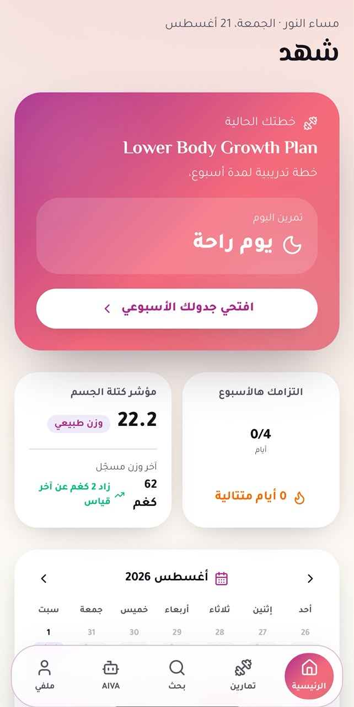
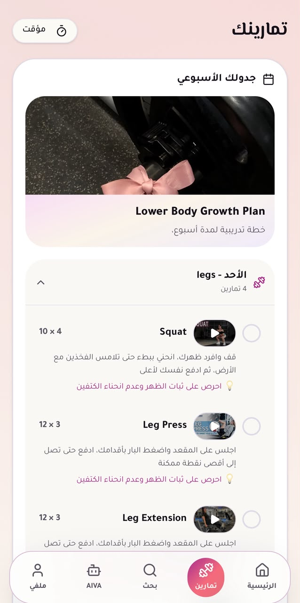
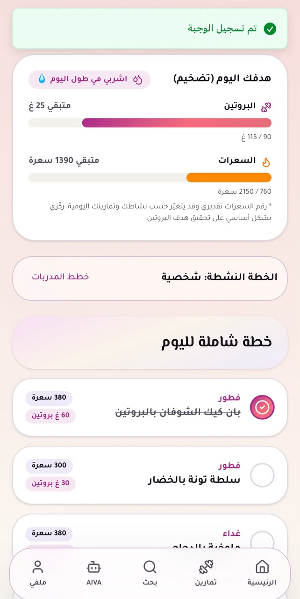
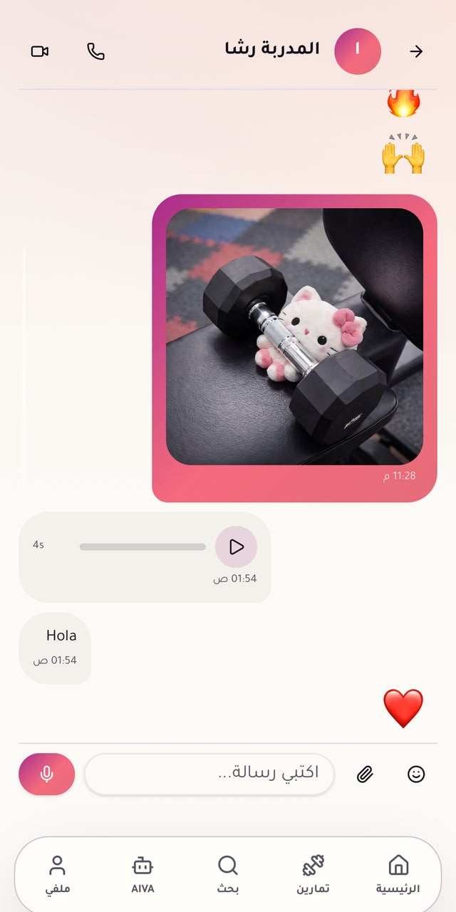
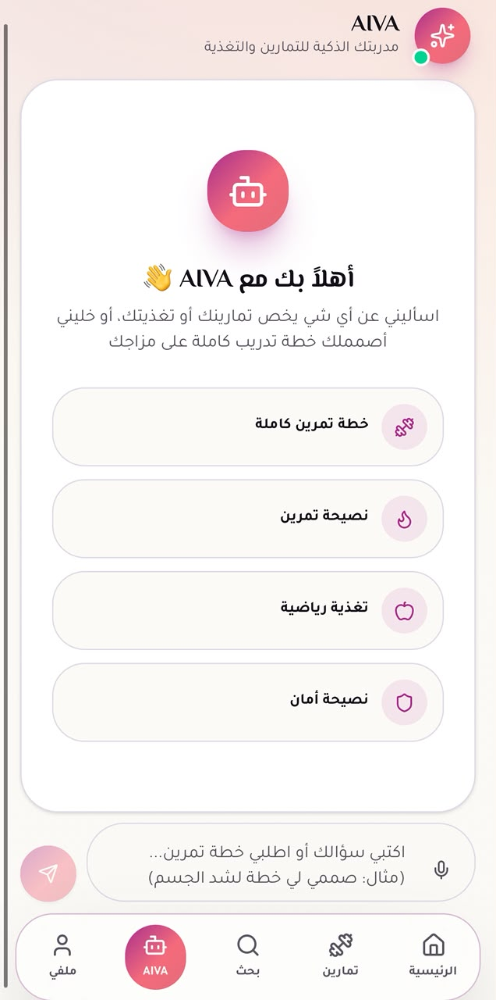

# 🌸 Evolva

> **A women-focused fitness, wellness, and lifestyle platform designed to bring workouts, nutrition, personalization, trainers, and community into one experience.**

Evolva is a modern fitness platform built around a simple idea: **fitness should be more personal than just tracking workouts.**

Instead of being only a workout tracker, Evolva combines personalized training, nutrition guidance, progress tracking, trainer interaction, social content, and an intelligent fitness assistant in one feminine, mobile-first experience.

---

## ✨ Overview

Evolva is designed for women who want to build a healthier lifestyle while having access to:

- 🏋️ Personalized workout plans
- 🥗 Nutrition and daily nutrition targets
- 📊 Body composition and progress tracking
- 📅 Weekly workout scheduling
- 👩‍🏫 Trainers and coaching
- 💬 Communication with coaches and other users
- 🌷 Fitness-focused social posts and community
- 🤖 **AIVA**, an intelligent fitness assistant
- 👤 Personalized user profiles
- 🔔 Notifications and activity updates

The goal is to create an ecosystem where **fitness, nutrition, coaching, and community work together** rather than existing as separate features.

---

## 🎯 Main Goals

Evolva focuses on four main pillars:

| Pillar | Purpose |
|---|---|
| 🏋️ Fitness | Personalized workouts, plans, schedules, and exercise tracking |
| 🥗 Nutrition | Daily calories, protein targets, meals, and nutrition plans |
| 👩‍🏫 Coaching | Trainers, coaching plans, communication, and guidance |
| 💬 Community | Posts, profiles, conversations, and social interaction |

All four pillars are connected through personalization based on the user's goals and fitness information.

---

## 📱 Application Features

### 🏠 Personalized Home Dashboard

The home screen gives the user a quick overview of her current fitness journey.

It includes:

- Current training plan
- Today's workout/rest status
- Weekly workout progress
- Body composition indicators
- Weight tracking
- Training streaks
- Monthly calendar
- Nutrition plan shortcut
- Trainers and chat shortcuts

The dashboard is designed to make the most important information available at a glance.

---

### 🏋️ Workout System

Evolva provides structured workout plans based on the user's goals.

Example goals include:

- **Lose Weight**
- **Gain Muscle**
- **Improve Fitness**
- **Tone the Body**
- **Lower Body / Glute Focus**
- Personalized body-composition goals

Workout plans can include:

- Exercise name
- Sets
- Repetitions
- Exercise instructions
- Technique tips
- Exercise demonstrations
- Weekly schedule
- Workout completion tracking

The application also supports a calendar-based view so users can understand their training week and rest days.

---

### 🥗 Nutrition

Nutrition is treated as part of the fitness journey rather than a separate feature.

The nutrition experience can provide:

- Daily calorie targets
- Protein targets
- Meals
- Nutrition plans
- Daily progress
- Personalized recommendations

A basic protein-targeting approach can be calculated according to the user's goal, for example:

```text
Bulking / Muscle Gain  → ~1.8 g/kg
Cutting / Fat Loss     → ~2.0 g/kg
Maintenance / General  → ~1.6 g/kg
```

The actual experience can be extended with additional personalization based on activity level, body metrics, and goals.

---

### 🤖 AIVA — Smart Fitness Assistant

**AIVA** is Evolva's intelligent fitness assistant.

It acts as a conversational layer on top of the fitness experience, allowing users to ask for help with topics such as:

- Full workout plans
- Exercise recommendations
- Training advice
- Nutrition questions
- Safety tips
- Fitness-related guidance

Example:

> "صممي لي خطة تمرين لشد الجسم"

AIVA can use the user's fitness context to provide a more relevant response instead of treating every user as the same.

---

### 👩‍🏫 Trainers & Coaching

Evolva is designed to support a trainer ecosystem in addition to automated fitness features.

Trainer functionality can include:

- Trainer profiles
- Workout plans
- Nutrition plans
- Coaching relationships
- User communication
- Personalized guidance
- Trainer content

This makes Evolva closer to a **fitness platform + coaching community** rather than a traditional workout tracker.

---

### 💬 Social & Community

The platform also includes a social layer where users can interact around fitness and wellness.

Community functionality includes concepts such as:

- Posts
- User profiles
- Trainer profiles
- Following / interaction
- Notifications
- Conversations
- Coach messaging
- User-to-user communication

This creates a space where users can share their progress, discover content, communicate with trainers, and stay engaged with the fitness community.

---

### 👤 User Profiles

Each user has a personalized profile containing fitness-related information and activity.

The profile experience can include:

- Personal information
- Fitness goals
- Progress
- Workout activity
- Nutrition information
- Social activity
- Trainer relationships

---

## 🌷 Personalization

Personalization is one of the main concepts behind Evolva.

During onboarding, the platform can collect information such as:

- Height
- Weight
- Age
- Fitness goal
- Activity level
- Training frequency
- Available equipment
- Dietary preferences

This information can then be used to build a more relevant experience.

### Example

Instead of giving every user the same workout:

```text
User Goal
   ↓
Fitness Profile
   ↓
Training Preferences
   ↓
Personalized Workout Plan
   ↓
Weekly Schedule
   ↓
Progress Tracking
```

The same principle can be applied to nutrition and coaching.

---

📸 Screenshots

Home Dashboard



Weekly Workout Schedule



Nutrition Plan



Workout Details



AIVA Fitness Assistant



Note: Add the provided screenshots to a screenshots/ folder in the repository using the filenames above, or update the paths in this README to match your actual filenames.

---

## 🧩 Main Application Modules

```text
Evolva
│
├── 🏠 Dashboard
│
├── 🏋️ Workouts
│   ├── Workout Plans
│   ├── Exercises
│   ├── Weekly Schedule
│   └── Workout Tracking
│
├── 🥗 Nutrition
│   ├── Nutrition Plans
│   ├── Meals
│   ├── Calories
│   └── Protein Targets
│
├── 👩‍🏫 Trainers
│   ├── Trainer Profiles
│   ├── Coaching
│   └── Trainer Plans
│
├── 💬 Community
│   ├── Posts
│   ├── Profiles
│   └── Interactions
│
├── 💬 Chat
│   ├── Coach Conversations
│   └── User Conversations
│
├── 🤖 AIVA
│   └── Fitness Assistant
│
├── 🔔 Notifications
│
├── 👤 Profile
│
└── ⚙️ Settings
```

---

## 🗄️ Database Architecture

The backend is designed around a relational PostgreSQL database using Supabase.

Core entities include:

```text
profiles
user_fitness_profile
trainers
posts
subscriptions

workout_plans
workout_plan_exercises
user_workout_plans
user_workout_exercises
workout_logs

nutrition_plans
nutrition_plan_meals
user_nutrition_plans

active_plan_selection
weekly_schedules
```

The database structure separates:

- Global workout/nutrition plans
- User-specific plan assignments
- User progress and logs
- Trainer relationships
- Social content
- Fitness profiles

Row Level Security (**RLS**) policies are used to protect user-specific data.

---

## 🛠️ Tech Stack

| Technology | Role |
|---|---|
| **Next.js** | Application framework |
| **React** | Frontend UI |
| **TypeScript** | Type-safe development |
| **Supabase** | Backend, authentication & database |
| **PostgreSQL** | Relational database |
| **Vercel** | Deployment |
| **TanStack** | Data and state management utilities |
| **PWA / Web App Manifest** | Mobile-like web experience |
| **YouTube Integration** | Exercise demonstrations |
| **Anime.js** | UI animations |
| **MDX / Markdown** | Documentation where applicable |

---

## 🎨 Design System

Evolva follows a **mobile-first, feminine, soft, and modern** visual direction.

### Design characteristics

- 🌸 Pastel pink gradients
- 🤍 Clean white surfaces
- 🟣 Soft purple/pink accents
- 🧘 Minimal visual noise
- 📱 Mobile-first layouts
- 🔄 Rounded cards and controls
- ✨ Subtle animations
- 🇸🇦 Arabic RTL support

Typography can use Arabic-friendly fonts such as:

- Cairo
- Tajawal
- IBM Plex Sans Arabic

The interface is designed to feel **premium, friendly, and approachable** rather than like a traditional gym management system.

---

## 🔐 User Experience & Privacy

Because Evolva is designed around personal fitness information, the architecture considers user-specific data protection.

Examples include:

- Authentication
- User-specific profiles
- Protected database records
- Row Level Security (RLS)
- Controlled access to private conversations
- User-specific workout and nutrition plans

The platform can also be configured as a women-focused ecosystem, with onboarding and account policies aligned with that product direction.

---

## 🚀 Getting Started

Clone the repository:

```bash
git clone https://github.com/YOUR_USERNAME/evolva.git
cd evolva
```

Install dependencies:

```bash
npm install
```

Create a `.env.local` file:

```env
NEXT_PUBLIC_SUPABASE_URL=your_supabase_url
NEXT_PUBLIC_SUPABASE_ANON_KEY=your_supabase_anon_key
```

Run the development server:

```bash
npm run dev
```

Open:

```text
http://localhost:3000
```

---

## 📈 Future Development

Potential future improvements include:

- 🤖 More advanced AIVA personalization
- 🧍 3D fitness avatar
- 🎯 Body-area goal selection
- 📊 Advanced progress analytics
- 🧠 AI-generated workout plans
- 🥗 AI-assisted meal planning
- 👩‍🏫 Trainer subscriptions
- 💳 Premium memberships
- 🔔 Advanced push notifications
- 🏆 Challenges and achievements
- 👥 Community engagement features
- 📱 Native mobile application

---

## 💡 Product Vision

Evolva is built around the idea that a woman's fitness journey should not be reduced to:

> **"Do these exercises and track your reps."**

Instead, the experience connects:

```text
             🌸 EVOLVA
                 │
     ┌───────────┼───────────┐
     ↓           ↓           ↓
  FITNESS    NUTRITION   COMMUNITY
     │           │           │
  Workouts      Meals       Posts
  Plans         Goals       Chat
  Tracking      Targets     Trainers
     │           │           │
     └───────────┼───────────┘
                 ↓
          PERSONALIZATION
                 ↓
          HEALTHY LIFESTYLE
```

The long-term vision is to create a **personalized women's fitness and wellness ecosystem** where training, nutrition, coaching, and community are connected in one platform.

---

## 🌸 Brand

**Evolva**

The name is inspired by the idea of:

> **Evolution + Growth + Women**

It represents continuous improvement — not only in physical appearance, but also in strength, confidence, consistency, and lifestyle.

---

## 📌 Project Status

**Evolva is an evolving product concept and application focused on women's fitness, wellness, personalization, and community.**

The project demonstrates a combination of:

- Product design
- Full-stack web development
- Database architecture
- Fitness personalization
- Social features
- Trainer workflows
- AI-assisted experiences
- Responsive mobile-first UI

---

## 👩‍💻 Author

**Shahed Nazzal**

Designed and developed as a personal product concept and full-stack application.

---

## 📄 License

This project is currently provided for educational, portfolio, and development purposes.

If you plan to make the repository fully open-source, add an appropriate license such as the MIT License.
